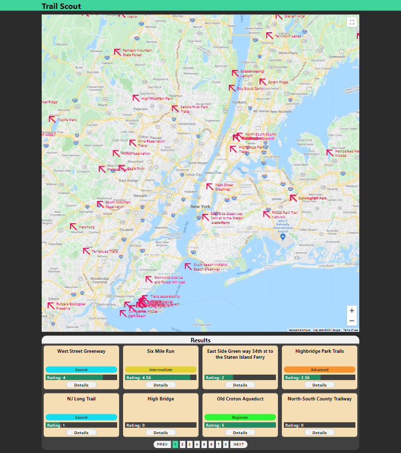

# Trail-Scout-v2

## Description
Trail Scout is an interactive application that allows users to find trails to bike or hike. The website can be visited [HERE](https://markkhoo.github.io/Trail-Scout-v2/). 

## How to Use
Navigate through the Google Map to search for trails. Trails will populate below and can be clicked for more details.



## Code Snippet
This section of code populates a state of information to be displayed at the bottom of the main page.
```typescript
useEffect(() => {
    const currentPageNumber: number = getPageN;
    let displayTrails: TrailData[] = [];
    for (let j = (currentPageNumber - 1) * 8; j < currentPageNumber * 8; j++) {
        if (getTrail[j]) {
            displayTrails.push(getTrail[j])
        }
    }
    setShown(displayTrails);
    // eslint-disable-next-line react-hooks/exhaustive-deps
}, [getPages, getPageN]);
```
Line by line, the code does the following:
1. Calls a React `useEffect` hook.
2. Takes the current page number (of trail searches) from a state and stores it in a variable.
3. Declares an empty array variable using a type that can hold TrailAPI data
4. A for loop that steps through a particular section of all fetched TrailAPI data. For example: if there are 16 total trails fetched from the API and we are currently on page 2, we will loop from position 8 to 15.
5. A ternary operation that check to see if the postion of the array of all fetched trails has data. We do this because the total amount of fetched trails may not be a multiple of 8. For example if there are 10 total trails fetched from the API and we are currently on page 2, we still loop from postion 8 to 15 but there is only data from position 8 to 9.
6. Push trail data into the array variable declared earlier (if it exists).
7. A closing bracket.
8. A closing bracket.
9. Set a state with the array variable now with trail data.
10. Disable an eslint message warning about a state not being added to the `useEffect` dependancy. Specifically, the `useEffect` uses a state, `getTrail`. But we do not want the side effect to occur every time this state changes (which would be redudant to `getPageN`, which changes whenever `getTrail` changes). 
11. Declare the state dependancies, in an array, which triggers the side effect whenever those states change.

## Technologies Used
* [TypeScript](https://www.typescriptlang.org/)
* [React.js](https://github.com/facebook/create-react-app)
* [Node.js](https://nodejs.org/en/docs/)
* JavaScript ES6
* HTML
* CSS
* API's:
  * [Google Maps Platform](https://developers.google.com/maps)
  * [TrailAPI](https://rapidapi.com/trailapi/api/trailapi)
  * [OpenWeatherMap](https://openweathermap.org/)

## Author's Aside
I created this application as a way to learn `TypeScript`, which of course I have not used before this. This application is a spiritual successor to a [previous project](https://github.com/markkhoo/Trail-Scout) but implementing features that were post-MVP goals. This is also the first time I have ever used the `Google Maps Platform`. 

Additionally, I have purposefully not taken any steps in SEO because this application has exposed keys. I know that a proper way to hide those keys would be too utilize them on the server side. But because this application does not have a server, there are no known ways (at least to me) to protect the keys on the client side. If anyone has an idea how, feel free to message me 😂